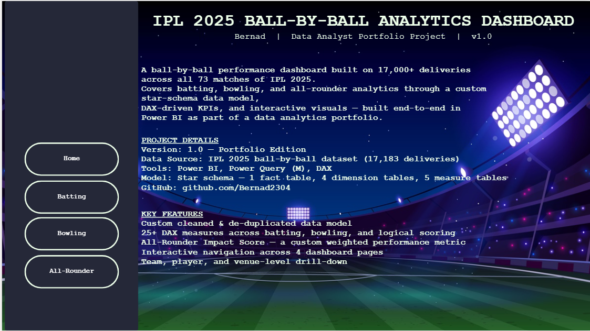
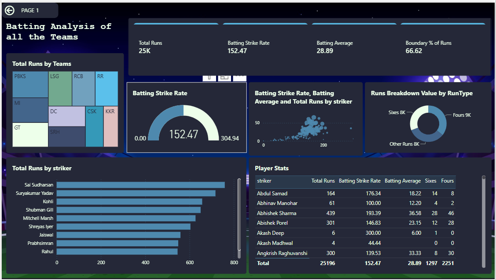
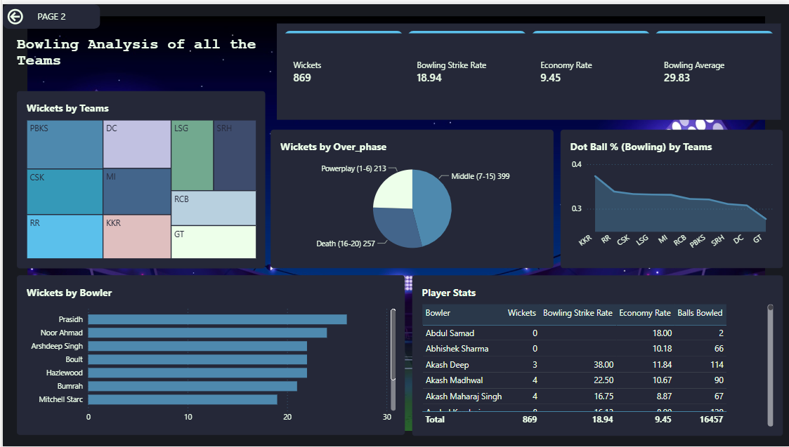
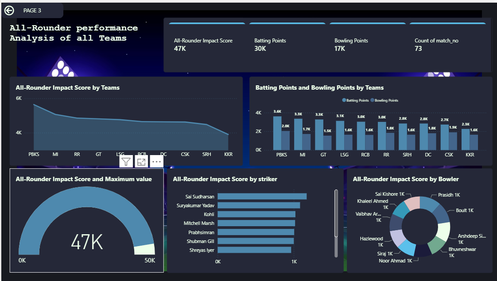

  

  

  
  
  
  
  
  

---

## Screenshots

| Cover | Batting |
|---|---|
|  |  |

| Bowling | All-Rounder |
|---|---|
|  |  |

---

## Key Insights

**Batting**
1. Boundary-driven scoring — 66.7% of all runs this season came from 4s and 6s, showing how power-hitting-heavy IPL 2025 was compared to a "rotate the strike" approach.
2. Sai Sudharsan led all batters with 759 runs, ahead of Suryakumar Yadav (717) and Kohli (657) — the season's standout run-scorer.
3. A tournament-wide strike rate of 152.47 against a batting average of 28.89 shows batters consistently prioritized aggression over occupying the crease.
4. The top 10 run-scorers list is dominated by top-order batters (openers and No. 3s), showing the scoring load fell heavily on the top of the order rather than being spread through the middle order.
5. Boundary percentage varies meaningfully by player — useful as a scouting signal for identifying genuine six-hitters vs. accumulators who just bat long innings.

**Bowling**
1. Death overs (16-20) accounted for 45.9% of all wickets — nearly double the Powerplay share (29.6%) — confirming batters take the most risk, and bowlers get the most rewards, at the death.
2. Fast bowlers dominate the wicket charts (Prasidh Krishna, Boult, Hazlewood, Bumrah, Starc) — spin (Noor Ahmad aside) played a smaller wicket-taking role this season.
3. Dot-ball percentage by team ranges from 37% (KKR) down to 28% (GT) — a 9-point spread that directly explains why some attacks control totals better than others.
4. A tournament economy rate of 9.45 confirms this was a high-scoring, bowler-under-pressure season overall.
5. Bowling strike rate (18.9 balls per wicket) paired with the high economy suggests bowlers are taking wickets, just at a cost — supporting the case for teams prioritizing containment-focused death bowlers in auctions.

**All-Rounder Analysis**
1. Punjab Kings (PBKS) had the highest combined All-Rounder Impact Score (~5.6K) of any team — the deepest all-round squad this season by this metric.
2. Batting Points (30K) outweigh Bowling Points (17K) tournament-wide, showing the format currently rewards bat-first all-rounders more than bowl-first ones.
3. Players like Sai Sudharsan and Suryakumar Yadav rank near the top of both the pure batting charts and the All-Rounder charts — genuine dual-format value for their franchises.
4. Team Impact Scores drop off steadily after the top few teams — most squads cluster in the middle, meaning true all-round depth is a differentiator held by only a handful of teams.
5. The custom qualifier logic (minimum balls faced + minimum balls bowled) filters out one-off contributors, giving a more honest picture of who's a real all-rounder versus a specialist who occasionally chips in.

---

## Business Recommendations

1. **Auction strategy** — prioritize bidding on balanced all-rounders (per the Impact Score) over one-dimensional stars, since squad depth at the top teams (PBKS) correlates with all-round balance, not just star batting/bowling talent alone.
2. **Death-bowling investment** — given 45.9% of wickets and the bulk of economy pressure happen in overs 16-20, franchises should prioritize coaching and recruitment budget on yorker/variation specialists over generic pace depth.
3. **Dot-ball coaching focus** — teams like GT (28% dot-ball rate) should target structured death-over drills to close the gap with disciplined attacks like KKR (37%), directly reducing runs conceded without needing new personnel.
4. **Top-order scouting pipeline** — build a long-term retention plan around emerging top-order run-scorers like Sai Sudharsan before their market value rises further, based on this season's form data.
5. **Adopt phase-wise analytics in matchday strategy** — use Powerplay/Middle/Death breakdowns (already built into this dashboard) as a live team-meeting tool for bowling change decisions, rather than reviewing only post-match.

---

## Skills Demonstrated

**Data Modeling & ETL**
- Power Query (M) — data cleaning, entity de-duplication, calculated columns, query referencing, star schema design
- Star schema data modeling — fact/dimension separation, role-playing dimensions, relationship design

**Analytics & Calculation**
- DAX — 25+ measures across 5 dedicated measure tables (Batting, Bowling, Venue, Logical, General)
- Custom KPI design — including a proprietary weighted All-Rounder Impact Score
- Statistical validation — cross-checking dashboard output against raw data to catch calculation errors

**Visualization & Dashboard Design**
- Power BI — bar/column/scatter/treemap/donut/decomposition tree/map visuals, bookmarks, page navigation, custom theming
- Data storytelling — translating raw ball-by-ball data into business-relevant insights and recommendations

**Broader Analyst Toolkit** *(from other portfolio projects)*
- Excel — pivot tables, SUMIFS/COUNTIFS/AVERAGEIFS, KPI dashboards
- SQL — querying and analysis (E-Learning Purchase Analysis project)
- Python — Pandas, NumPy, Matplotlib, Seaborn (Customer Support Ticket Analyzer, Social Media Engagement Analytics)
- Agile/Scrum familiarity
